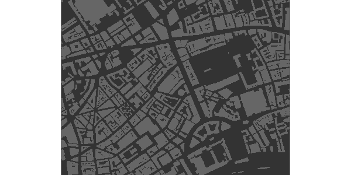
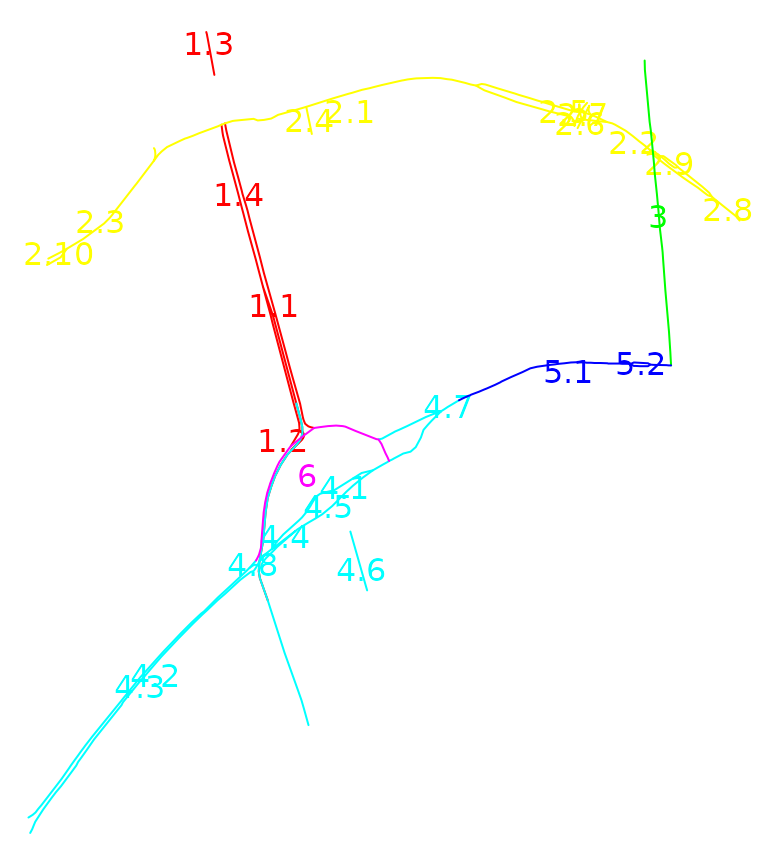
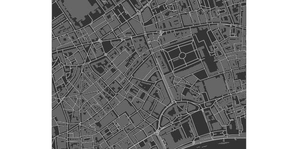
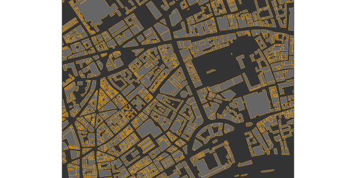
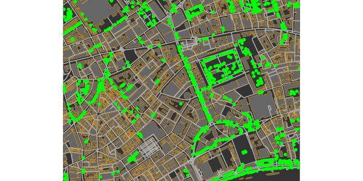
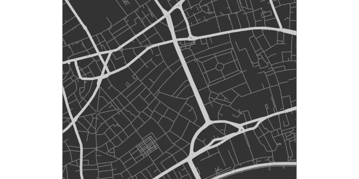
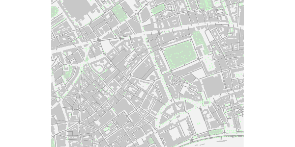
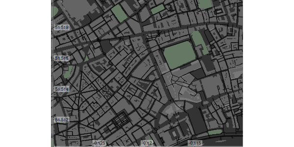
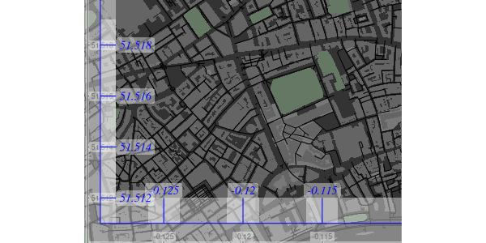

# Basic Maps

The **R** package `osmplotr` uses OpenStreetMap (OSM) data to produce
highly customisable maps. Data are downloaded via the [`osmdata`
package](https://cran.r-project.org/package=osmdata), and different
aspects of map data - such as roads, buildings, parks, or water bodies -
are able to be visually customised. This vignette demonstrates both data
downloading and the creation of simple maps. The subsequent vignette
([‘data-maps’](https://cran.r-project.org/package=osmplotr))
demonstrates how `osmplotr` enables user-defined data to be visualised
using OSM data. The maps in this vignette represent a small portion of
central London, U.K.

## 1. Introduction

A map can be generated using the following simple steps:

1.  Specify the bounding box for the desired region

``` r

bbox <- get_bbox (c (-0.13, 51.51, -0.11, 51.52))
```

2.  Download the desired data—in this case, all building perimeters.

``` r

dat_B <- extract_osm_objects (key = "building", bbox = bbox)
```

3.  Initiate an `osm_basemap` with desired background (`bg`) colour

``` r

map <- osm_basemap (bbox = bbox, bg = "gray20")
```

4.  Add desired plotting objects in the desired colour.

``` r

map <- add_osm_objects (map, dat_B, col = "gray40")
```

5.  Print the map

``` r

print_osm_map (map)
```



The function `print_osm_map` creates a graphics device that is scaled to
the bounding box of the map. Note also that `osmplotr` maps contain no
margins and fill the entire plot area, reflecting the general layout of
most printed maps. Additional capabilities of `osmplotr` are described
in the following sections, beginning with downloading and extraction of
data.

## 2. Downloading Data

The package [`osmdata`](https://cran.r-project.org/package=osmdata) is
used to download data from ‘OpenStreetMap’ using the ‘overpass’ API
[overpass API](https://overpass-api.de). Data may be returned in either
[‘Simple Features’ (`sf`)](https://cran.r-project.org/package=sf) or [‘R
Spatial’ (`sp`)](https://cran.r-project.org/package=sp) form. `osmplotr`
has a convenience function, `extract_osm_objects`, to allow direct
import, or the functions of
[`osmdata`](https://cran.r-project.org/package=osmdata) can also be used
directly.

Data of a particular type can be extracted by specifying the appropriate
OSM `key`, as in the above example:

``` r

bbox <- get_bbox (c (-0.13, 51.51, -0.11, 51.52))
dat_B <- extract_osm_objects (key = "building", bbox = bbox)
dat_H <- extract_osm_objects (key = "highway", bbox = bbox)
```

These objects are of appropriate `Spatial` classes:

``` r

class (dat_B)
```

    ## [1] "sf"         "data.frame"

``` r

class (dat_H)
```

    ## [1] "sf"         "data.frame"

``` r

class (dat_B$geometry)
```

    ## [1] "sfc_POLYGON" "sfc"

``` r

class (dat_H$geometry)
```

    ## [1] "sfc_LINESTRING" "sfc"

`Spatial` ([`sp`](https://cran.r-project.org/package=sf)) objects may be
returned with,

``` r

dat_B <- extract_osm_objects (key = "building", bbox = bbox, sf = FALSE)
```

otherwise `sf` is used as the default format. The Simple Features (`sf`)
objects with polygons of London buildings and linestrings of highways
respectively contain

``` r

nrow (dat_B)
```

    ## [1] 1767

``` r

nrow (dat_H)
```

    ## [1] 1220

… 1,759 building polygons and 1,133 highway lines. `extract_osm_objects`
also accepts `key-value` pairs which are passed to the [overpass
API](https://overpass-api.de) :

``` r

dat_T <- extract_osm_objects (key = "natural", value = "tree", bbox = bbox)
```

Trees are located by single coordinates and are thus point objects:

``` r

class (dat_T$geometry)
```

    ## [1] "sfc_POINT" "sfc"

``` r

nrow (dat_T)
```

    ## [1] 688

### 2.1 `osmdata`

The [`osmdata`](https://cran.r-project.org/package=osmdata) package
provides a more powerful interface for downloading OSM data, and may be
used directly with `osmplotr`. The `osmplotr` function
`extract_osm_objects` is effectively just a convenience wrapper around
`omsdata` functionality. The primary differences between the two are:

1.  `osmdata` returns *all* spatial data for a given query; that is,
    *all* points, lines, polygons, multilines, and multipolygons, while
    `osmplotr` returns a single specified geometric type.
2.  `osmplotr` accepts multiple `key-value` pairs in a single call to
    `extract_osm_objects`, which the equivalent `osmdata` function,
    `add_feature`, accepts only a single `key-value` pair, with queries
    successively build through multiple calls to `add_feature`.

These differences are illustrated in the following code which generates
identical results in both cases (with namespaces explicitly given to aid
clarity),

``` r

dat1 <- osmplotr::extract_osm_objects (
    key = "highway", value = "!primary",
    bbox = bbox
)
dat2 <- osmdata::opq (bbox = bbox) %>%
    add_feature (key = "highway") %>%
    add_feature (key = "highway", value = "!primary") %>%
    osmdata_sf ()
dat2 <- dat2$osm_lines
```

The `osmdata` function
[`opq()`](https://docs.ropensci.org/osmdata/reference/opq.html)
constructs an overpass query, with successive calls to `add_feature`
extending the query until it is finally submitted to overpass by
[`osmdata_sf()`](https://docs.ropensci.org/osmdata/reference/osmdata_sf.html)
(or the `sp` version
[`osmdata_sp()`](https://docs.ropensci.org/osmdata/reference/osmdata_sp.html)).

Note that `add_feature()` has to be called twice in this case, because a
single call to `add_feature (key = 'highway", value = "!primary")` would
request *all* features that are not primary highways. The initial query
for `key = "highway"` ensures that only npn-primary highways are
returned.

### 2.2 Negation

As demonstrated above, negation can be specified by pre-pending `!` to
the `value` argument so that, for example, all `natural` objects that
are **not** trees can be extracted with

``` r

dat_NT <- extract_osm_objects (bbox = bbox, key = "natural", value = "!tree")
```

    ## Cannot determine return type; maybe specify explicitly?

The message is generated because of course a request for anything that
is not a tree could be for any kind of spatial object. `osmplotr` makes
several educated guesses in the absence of specified return types, but
these can always be forced with the `return_type` parameter:

``` r

pts_NT <- extract_osm_objects (
    bbox = bbox, key = "natural", value = "!tree",
    return_type = "points"
)
```

`london$dat_H` contains all non-primary highways, and was extracted with
the call demonstrated above, while `london$dat_HP` contains the
corresponding set of exclusively primary highways. An `osmplotr` request
for `key = "highway"` automatically returns line objects (although,
again, other kinds of objects may be forced through specifying
`return_type`).

### 2.3 Additional `key-value` pairs

Any number of `key-value` pairs may be passed to `extract_osm_objects`.
For example, a named building can be extracted with

``` r

bbox <- get_bbox (c (-0.13, 51.50, -0.11, 51.52))
extra_pairs <- c ("name", "Royal.Festival.Hall")
dat <- extract_osm_objects (
    key = "building", extra_pairs = extra_pairs,
    bbox = bbox
)
```

These data are stored in `london$dat_RFH`. Note that periods or dots are
used for white space, and in fact symbolise (in `grep` terms) any
character whatsoever. The polygon of a building at a particular street
address can be extracted with

``` r

extra_pairs <- list (
    c ("addr:street", "Stamford.St"),
    c ("addr:housenumber", "150")
)
dat <- extract_osm_objects (
    key = "building", extra_pairs = extra_pairs,
    bbox = bbox
)
```

These data are stored as `london$dat_ST`. Note that addresses generally
require combining both `addr:street` with `addr:housenumber`.

### 2.4 Downloading with `osm_structures` and `make_osm_map`

The functions `osm_structures` and `make_osm_map` aid both downloading
multiple OSM data types and plotting (with the latter described below).
`osm_structures` returns a `data.frame` of OSM structure types,
associated `key-value` pairs, unique suffices which may be appended to
data structures for storage purposes, and suggested colours. Passing
this list to `make_osm_map` will return a list of the requested OSM data
items, named through combining the `dat_prefix` specified in
`make_osm_map` and the suffices specified in `osm_structures`.

``` r

osm_structures ()
```

    ##     structure      key value suffix      cols
    ## 1    building building           BU #646464FF
    ## 2     amenity  amenity            A #787878FF
    ## 3    waterway waterway            W #646478FF
    ## 4       grass  landuse grass      G #64A064FF
    ## 5     natural  natural            N #647864FF
    ## 6        park  leisure  park      P #647864FF
    ## 7     highway  highway            H #000000FF
    ## 8    boundary boundary           BO #C8C8C8FF
    ## 9        tree  natural  tree      T #64A064FF
    ## 10 background                          gray20

Many structures are identified by keys only, in which cases the values
are empty strings.

``` r

osm_structures ()$value [1:4]
```

    ## [1] ""      ""      ""      "grass"

The last row of `osm_structures` exists only to define the background
colour of the map, as explained below ([4.3 Automating map
production](#id_4.3%20Automating%20map%20production)).

The suffices include as many letters as are necessary to represent all
unique structure names. `make_osm_map` returns a list of two components:

1.  `osm_data` containing the data objects passed in the
    `osm_structures` argument. Any existing `osm_data` may also be
    submitted to `make_osm_map`, in which case any objects not present
    in the submitted data will be appended to the returned version. If
    `osm_data` is not submitted, all objects in `osm_structures` will be
    downloaded and returned.
2.  `map` containing the `ggplot2` map objects with layers overlaid
    according to the sequence and colour schemes specified in
    `osm_structures`

The data specified in `osm_structures` can then be downloaded simply by
calling:

``` r

dat <- make_osm_map (structures = osm_structures (), bbox = bbox)
```

``` r

names (dat)
```

    ## [1] "osm_data" "map"

``` r

sapply (dat, class)
```

    ## $osm_data
    ## [1] "list"
    ## 
    ## $map
    ## [1] "ggplot2::ggplot" "ggplot"          "ggplot2::gg"     "S7_object"      
    ## [5] "gg"

``` r

names (dat$osm_data)
```

    ## [1] "dat_BU" "dat_A"  "dat_W"  "dat_G"  "dat_N"  "dat_P"  "dat_H"  "dat_BO"
    ## [9] "dat_T"

The requested data are contained in `dat$osm_data`. A list of desired
structures can also be passed to this function, for example,

``` r

osm_structures (structures = c ("building", "highway"))
```

    ##    structure      key value suffix      cols
    ## 1   building building            B #646464FF
    ## 2    highway  highway            H #000000FF
    ## 3 background                          gray20

Passing this to `make_osm_map` will download only these two structures.
Finally, note that the example of,

``` r

osm_structures (structures = "grass")
```

    ##    structure     key value suffix      cols
    ## 1      grass landuse grass      G #64A064FF
    ## 2 background                         gray20

demonstrates that `osm_structures` converts a number of common `keys` to
OSM-appropriate `key-value` pairs.

#### 2.4.1 The `london` data of `osmplotr`

To illustrate the use of `osm_structures` to download data, this section
reproduces the code that was used to generate the `london` data object
which forms part of the `osmplotr` package.

``` r

structures <- c (
    "highway", "highway", "building", "building", "building",
    "amenity", "park", "natural", "tree"
)
structs <- osm_structures (structures = structures, col_scheme = "dark")
structs$value [1] <- "!primary"
structs$value [2] <- "primary"
structs$suffix [2] <- "HP"
structs$value [3] <- "!residential"
structs$value [4] <- "residential"
structs$value [5] <- "commercial"
structs$suffix [3] <- "BNR"
structs$suffix [4] <- "BR"
structs$suffix [5] <- "BC"
```

Suffices are generated automatically from structure names only, not
values, and the suffices for negated forms must therefore be specified
manually. The `london` data can then be downloaded by simply calling
`make_osm_map`:

``` r

london <- make_osm_map (structures = structs, bbox = bbox)$osm_data
```

The requested data are contained in the `$osm_data` list item.
`make_osm_map` also returns a `$map` item which is described below (see
[4.3 Automating map production](#id_4.3%20make-osm-map)).

## 3. Downloading connected highways

The visualisation functions described in the second `osmplotr` vignette
([Data maps](https://cran.r-project.org/package=osmplotr)) enable
particular regions of maps to be highlighted. While it may often be
desirable to highlight regions according to a user’s own data,
`osmplotr` also enables regions to be defined by providing a list of the
names of encircling highways. The function which achieves this is
`connect_highways`, which returns a sequential matrix of coordinates
from those segments of the named highways which connected continuously
and sequentially to form a single enclosed space. An example is,

``` r

highways <- c (
    "Monmouth.St", "Short.?s.Gardens", "Endell.St", "Long.Acre",
    "Upper.Saint.Martin"
)
highways1 <- connect_highways (highways = highways, bbox = bbox)
```

Note the use of the
[regex](https://en.wikipedia.org/wiki/Regular_expression) character `?`
which declares that the previous character is optional. This matches
both “Shorts Gardens” and “Short’s Gardens”, both of which appear in OSM
data.

``` r

class (highways1)
```

    ## [1] "list"

``` r

length (highways1)
```

    ## [1] 5

``` r

highways1 [[1]] [[1]]
```

    ##                   lon      lat
    ## 1678452807 -0.1270287 51.51370
    ## 2265298898 -0.1270523 51.51362
    ## 438170687  -0.1270865 51.51347
    ## 3192197694 -0.1270902 51.51345
    ## 9513062    -0.1271692 51.51288

The extraction of bounding polygons from named highways is not
fail-safe, and may generate various warning messages. To understand the
kinds of conditions under which it may not work, it is useful to examine
`connect_highways` in more detail.

### 3.1 `connect_highways` in detail

`connect_highways` takes a list of OpenStreetMap highways and
sequentially connects closest nodes of adjacent highways until the set
of named highways connects to form a cycle. Cases where no circular
connection is possible generate an error message. The routine proceeds
through the three stages of,

1.  Adding intersection nodes to junctions of ways where these don’t
    already exist

2.  Filling a connectivity matrix between the listed highways and
    extracting the **longest** cycle connecting all of them

3.  Inserting extra connections between highways until the length of the
    longest cycle is equal to `length (highways)`.

This procedure can not be guaranteed fail-safe owing both to the
inherently unpredictable nature of OpenStreetMap, as well as to the
unknown relationships between named highways. To enable problematic
cases to be examined and hopefully resolved, `connect_highways` has a
`plot` option:

``` r

bbox_big <- get_bbox (c (-0.15, 51.5, -0.10, 51.52))
highways <- c (
    "Kingsway", "Holborn", "Farringdon.St", "Strand",
    "Fleet.St", "Aldwych"
)
highway_list <- connect_highways (
    highways = highways, bbox = bbox_big,
    plot = TRUE
)
```

    ## Warning: Cycle unable to be extended through all ways



The plot depicts each highway in a different colour, along with numbers
at start and end points of each segment. This plot reveals in this case
that highway#6 (“Aldwych”) is actually nested within two components of
highway#4 (“Strand”). `connect_highways` searches for the shortest path
connecting all named highways, and since “Strand” connects to both
highways#1 and \#5, the shortest path excludes \#6. This exclusion of
one of the named components generates the warning message.

These connected polygons returned from `connect_highways` can then be
used to highlight the enclosed regions within maps, as demonstrated in
the second vignette, [‘Data
Maps’](https://cran.r-project.org/package=osmplotr).

## 4. Producing maps

Maps will generally contain multiple kinds of OSM data, for example,

``` r

dat_B <- extract_osm_objects (key = "building", bbox = bbox)
dat_H <- extract_osm_objects (key = "highway", bbox = bbox)
dat_T <- extract_osm_objects (key = "natural", value = "tree", bbox = bbox)
```

As illustrated above, plotting maps requires first making a basemap with
a specified background colour. Portions of maps can also be plotted by
creating a `basemap` with a smaller bounding box.

``` r

bbox_small <- get_bbox (c (-0.13, 51.51, -0.11, 51.52))
map <- osm_basemap (bbox = bbox_small, bg = "gray20")
map <- add_osm_objects (map, dat_H, col = "gray70")
map <- add_osm_objects (map, dat_B, col = "gray40")
```

`map` is then a `ggplot2` which may be viewed simply by passing it to
`print_osm_map`:

``` r

print_osm_map (map)
```



Other graphical parameters can also be passed to `add_osm_objects`, such
as border colours or line widths and types. For example,

``` r

map <- osm_basemap (bbox = bbox_small, bg = "gray20")
map <- add_osm_objects (map, dat_B,
    col = "gray40", border = "orange",
    size = 0.2
)
print_osm_map (map)
```



The `size` argument is passed to the corresponding `ggplot2` routine for
plotting polygons, lines, or points, and respectively determines widths
of lines (for polygon outlines and for lines), and sizes of points. The
`col` argument determines the fill colour of polygons, or the colour of
lines or points.

``` r

map <- add_osm_objects (map, dat_H, col = "gray70", size = 0.7)
map <- add_osm_objects (map, dat_T, col = "green", size = 2, shape = 1)
print_osm_map (map)
```



Note also that the `shape` parameter determines the point shape, for
details of which see
[`?ggplot2::shape`](https://ggplot2.tidyverse.org/reference/aes_linetype_size_shape.html).
Also note that plot order affects the final outcome, because components
are sequentially overlaid and thus the same map components plotted in a
different order will generally produce a different result.

### 4.1 Saving Maps

The function
[`print_osm_map()`](https://docs.ropensci.org/osmplotr/reference/print_osm_map.md)
can be used to print either to on-screen graphical devices or to
graphics files (see, for example,
[`?png`](https://rdrr.io/r/grDevices/png.html) for a list of possible
graphics devices). Sizes and resolutions of devices may be specified
with the appropriate parameters. Device dimensions are scaled by default
to the proportions of the bounding box (although this can be
over-ridden).

A screen-based device simply requires

``` r

print_osm_map (map)
```

while examples of writing higher resolution versions to files include:

``` r

print_osm_map (map,
    filename = "map.png", width = 10,
    units = "in", dpi = map_dpi
)
print_osm_map (map,
    filename = "map.eps", width = 1000,
    units = "px", dpi = map_dpi
)
print_osm_map (map, filename = "map", device = "jpeg", width = 10, units = "cm")
```

### 4.2 Plotting different OSM Structures

The ability demonstrated above to use negation in `extract-osm-objects`
allows different kinds of the same object to be visually contrasted, for
example primary and non-primary highways:

``` r

dat_HP <- extract_osm_objects (key = "highway", value = "primary", bbox = bbox)
dat_H <- extract_osm_objects (key = "highway", value = "!primary", bbox = bbox)
```

``` r

map <- osm_basemap (bbox = bbox_small, bg = "gray20")
map <- add_osm_objects (map, dat_H, col = "gray50")
map <- add_osm_objects (map, dat_HP, col = "gray80", size = 2)
print_osm_map (map)
```



The additional `key-value` pairs demonstrated above (for Royal Festival
Hall, `dat_RFH` and 150 Stamford Street, `dat_ST`) also demonstrated
above allow for highly customised maps in which distinct objects are
plotting with different colour schemes.

``` r

bbox_small2 <- get_bbox (c (-0.118, 51.504, -0.110, 51.507))
map <- osm_basemap (bbox = bbox_small2, bg = "gray95")
map <- add_osm_objects (map, dat_H, col = "gray80")
map <- add_osm_objects (map, dat_HP, col = "gray20", size = 2)
map <- add_osm_objects (map, dat_RFH, col = "orange", border = "red", size = 2)
map <- add_osm_objects (map, dat_ST, col = "skyblue", border = "blue", size = 2)
print_osm_map (map)
```


### 4.3 Filling within boundary lines

Different portions of a map may sometimes be delineated by lines, for
example with coastlines which are always represented in OpenStreetMap as
lines. Plotting the water or land either side of a coastline in a single
block of colour requires the regions to be polygons, not lines.
`osmplotr` has a function
[`osm_line2poly()`](https://docs.ropensci.org/osmplotr/reference/osm_line2poly.md)
which converts boundary lines extending beyond a given bounding box into
polygons encircling the perimeter of the bounding box. An example is
given in
[`?osm_line2poly`](https://docs.ropensci.org/osmplotr/reference/osm_line2poly.md),
using both the `osmdata` package to obtain the bounding box of a named
region, and the `magrittr` pipe operator.

``` r

library (osmdata)
bb <- osmdata::getbb ("melbourne, australia")
coast <- extract_osm_objects (
    bbox = bb, key = "natural", value = "coastline",
    return_type = "line"
)
coast <- osm_line2poly (coast, bbox = bb)
map <- osm_basemap (bbox = bb) %>%
    add_osm_objects (coast [[1]], col = "lightsteelblue") %>%
    print_osm_map ()
```

The
[`osm_line2poly()`](https://docs.ropensci.org/osmplotr/reference/osm_line2poly.md)
function returns a list of two `sf` polygons. For coastline, one of
these will correspond to water, one to land. In the preceding example,
the first polygon is the ocean, which is coloured in `"lightsteelblue"`.
Users must determine for themselves which polygon is to be plotted in
which colour. Note that
[`osm_line2poly()`](https://docs.ropensci.org/osmplotr/reference/osm_line2poly.md)
only accepts `sf`-formatted data, and not `sp`.

### 4.4 Automating map production

As indicated above ([2.4 Downloading with `osm_structures` and
`make_osm_map`](#id_2.4%20downloading2)), the production of maps
overlaying various type of OSM objects is facilitated with
`make_osm_map`. The structure of a map is defined by `osm_structures` as
described above.

Producing a map with customised data is as simple as,

``` r

structs <- c ("highway", "building", "park", "tree")
structures <- osm_structures (structures = structs, col_scheme = "light")
dat <- make_osm_map (structures = structures, bbox = bbox_small)
print_osm_map (dat$map)
```



Calling
[`make_osm_map()`](https://docs.ropensci.org/osmplotr/reference/make_osm_map.md)
downloads the requested structures within the given `bbox` and returns a
list of two components, the first of which contains the downloaded data:

``` r

names (dat)
```

    ## [1] "osm_data" "map"

``` r

names (dat$osm_data)
```

    ## [1] "dat_B" "dat_H" "dat_P" "dat_A" "dat_P" "dat_T"

Pre-downloaded data may also be passed to
[`make_osm_map()`](https://docs.ropensci.org/osmplotr/reference/make_osm_map.md)

``` r

dat <- make_osm_map (
    structures = structures, osm_data = dat$osm_data,
    bbox = bbox
)
print_osm_map (dat$map)
```


Note that omitting the bounding box argument (`bbox`) produces a map
with a bounding box is extracted as the **largest** box spanning all
objects in `osm_data`. This may be considerably larger than the desired
boundaries, particularly because highways are returned by `overpass` in
their entirety, and will generally extend well beyond the specified
bounding box.

Finally, objects in maps are overlaid on the plot according to the order
of rows in `osm_structures`, with the single exception that `background`
is plotted first. This order can be readily changed or restricted simply
by submitting structures in a desired order.

``` r

structs <- c ("amenity", "building", "highway", "park")
osm_structures (structs, col_scheme = "light")
```

    ##    structure      key value suffix      cols
    ## 1    amenity  amenity            A #DCDCDCFF
    ## 2   building building            B #C8C8C8FF
    ## 3    highway  highway            H #969696FF
    ## 4       park  leisure  park      P #C8DCC8FF
    ## 5 background                          gray95

### 4.5 Axes

Axes may be added to maps using the `add_axes` function. In contrast to
many `R` packages for producing maps, maps in `osmplotr` fill the entire
plotting space, and axes are added *internal* to this space. The
separate function for adding axes allows them to be overlaid on top of
all previous layers.

Axes added to a dark version of the previous map look like this:

``` r

structures <- osm_structures (structures = structs, col_scheme = "dark")
dat <- make_osm_map (
    structures = structures, osm_data = dat$osm_dat,
    bbox = bbox_small
)
map <- add_axes (dat$map, colour = "black")
```

Note that, as described above, `make_osm_map` returns a list of two
items: (i) potentially modified data (in `$osm_data`) and (ii) the map
object (in `$map`). All other `add_` functions take a map object as one
argument and return the single value of the modified map object.

``` r

print_osm_map (map)
```



This map reveals that the axes and labels are printed above
semi-transparent background rectangles, with transparency controlled by
the `alpha` parameter. Axes are always plotted on the left and lower
side, but positions can be adjusted with the `pos` parameter which
specifies the positions of axes and labels relative to entire plot
device

``` r

map <- add_axes (map,
    colour = "blue", pos = c (0.1, 0.2),
    fontsize = 5, fontface = 3, fontfamily = "Times"
)
print_osm_map (map)
```



The second call to `add_axes` overlaid additional axes on a map that
already had axes from the previous call. This call also demonstrates how
sizes and other font characteristics of text labels can be specified.

Finally, the current version of `osmplotr` does not allow text labels of
axes to be rotated. (This is because the semi-transparent underlays are
generated with
[`ggplot2::geom_label`](https://ggplot2.tidyverse.org/reference/geom_text.html)
which currently prevents rotation.)

Click on the following link to proceed to the second `osmplotr`
vignette: [Data maps](https://cran.r-project.org/package=osmplotr)
